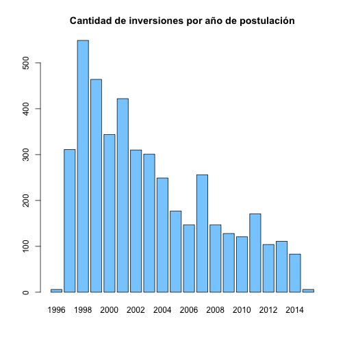
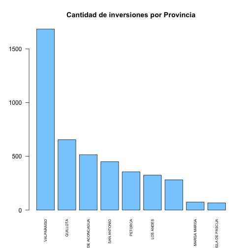
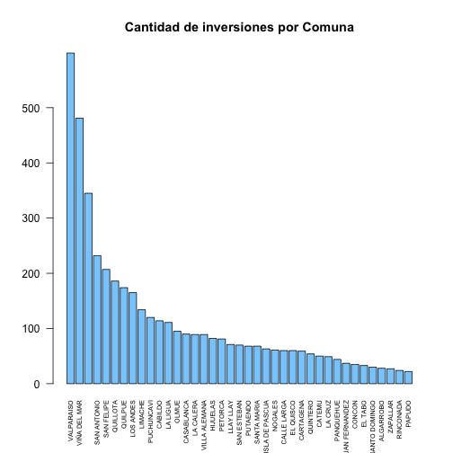
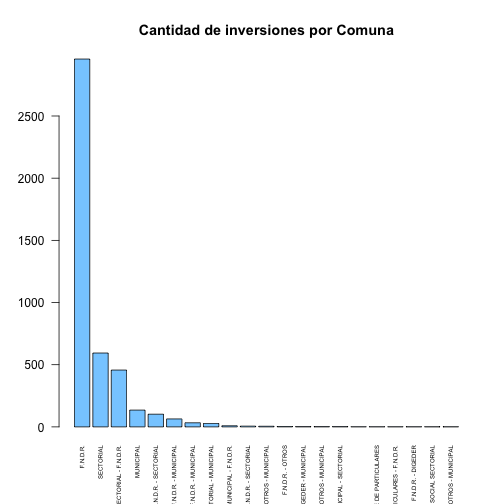

Análisis Dataset BPI Valparaiso-Educación y Cultura
========================================================

Análisis de datos BPI para la región de Valparaíso:


Nombre, dimensiones y tipo de variables

```r
names(BPI)
```

```
##  [1] "Código.BIP"                "Nombre.Iniciativa"        
##  [3] "Tipología"                 "Etapa.que.postula"        
##  [5] "Año.de.Postulación"        "Región"                   
##  [7] "Provincia"                 "Comuna"                   
##  [9] "Sector"                    "Sub.Sector"               
## [11] "Nombre.de.las.fuentes"     "RATE"                     
## [13] "Costo.Total"               "Solicitado.Año"           
## [15] "Institucion.Responsable"   "Devengado.SIGFE"          
## [17] "Ano.Postulación"           "Fecha.Postulación_SNI"    
## [19] "Fecha.Ingreso.SNI"         "Etapa.Actual"             
## [21] "Localización.Geográfica"   "Competencia.Ana"          
## [23] "Distrito"                  "Inicitativa.Relacionada"  
## [25] "Fuente.Financiera"         "SEIA"                     
## [27] "JUSTIFICACION"             "Descripción.Etapa"        
## [29] "Nombre.ADI"                "Situación"                
## [31] "Items"                     "Símbolo.Moneda"           
## [33] "Gasto.Anterior"            "Tipo.Cambio"              
## [35] "Fecha.Creación.Solicitud"  "Fecha.Ult..Mod..Solicitud"
## [37] "Devengado.SIGFE.1"         "Institución.FP"           
## [39] "Institución.Financiera"    "Usuario.RATE"             
## [41] "Institución.Técnica"       "Institución.Financiera.1" 
## [43] "Institución.Operacional"   "Fecha.Resultados"         
## [45] "Magnitud"                  "Valor.Magnitud"           
## [47] "Vida.Util"                 "Beneficiarios"            
## [49] "Fecha.Inicio.Iniciativa"   "Costo.Inicial"            
## [51] "Costo_Modificado"          "Costo.Licitación"         
## [53] "Indicadores"               "Monto.Aporte.Directo.M."  
## [55] "Monto.Otros.Aportes.M."    "Costo.Etapa.M."           
## [57] "Ejecución_Presupuestaria"  "Nombre.Usu..Ult..Mod."    
## [59] "Inst..Usu..Ult..Mod."      "Cargo.Usu..Ult..Mod."
```

```r
str(BPI)
```

```
## 'data.frame':	4407 obs. of  60 variables:
##  $ Código.BIP               : Factor w/ 1711 levels "20004126-0","20005114-0",..: 1657 1658 1660 1661 1662 1710 1337 1463 1474 1475 ...
##  $ Nombre.Iniciativa        : Factor w/ 1703 levels "ACTUALIZACION SISTEMA DE INFORMACION PLANTA FISICA SIPLAF II",..: 633 635 636 631 640 1396 365 1666 1673 1656 ...
##  $ Tipología                : Factor w/ 3 levels "ESTUDIO BASICO",..: 3 3 3 3 3 2 3 3 3 3 ...
##  $ Etapa.que.postula        : Factor w/ 4 levels "DISEÑO","EJECUCION",..: 2 2 2 2 2 2 1 1 1 1 ...
##  $ Año.de.Postulación       : int  2015 2015 2015 2015 2015 2015 2014 2014 2014 2014 ...
##  $ Región                   : Factor w/ 1 level "V REGION": 1 1 1 1 1 1 1 1 1 1 ...
##  $ Provincia                : Factor w/ 9 levels "","ISLA DE PASCUA",..: 3 9 8 8 6 2 9 9 8 8 ...
##  $ Comuna                   : Factor w/ 39 levels "","ALGARROBO",..: 19 36 33 33 14 12 38 13 33 26 ...
##  $ Sector                   : Factor w/ 1 level "EDUCACION Y CULTURA": 1 1 1 1 1 1 1 1 1 1 ...
##  $ Sub.Sector               : Factor w/ 10 levels "ADMINISTRACION EDUCACION Y CULTURA",..: 6 6 6 6 6 2 9 2 2 2 ...
##  $ Nombre.de.las.fuentes    : Factor w/ 21 levels "","APORTE DE PARTICULARES",..: 17 17 17 17 17 5 5 5 5 5 ...
##  $ RATE                     : Factor w/ 9 levels "","*","FA","FI",..: 1 1 1 1 1 1 9 9 9 9 ...
##  $ Costo.Total              : int  159988 115241 45774 163618 156291 274143 93042 89816 56154 48891 ...
##  $ Solicitado.Año           : int  159988 115241 45774 163618 156291 163911 27644 28163 33409 4900 ...
##  $ Institucion.Responsable  : Factor w/ 62 levels "ARQUITECTURA MOP V REGION DE VALPARAISO",..: 16 16 16 16 16 3 13 1 1 41 ...
##  $ Devengado.SIGFE          : int  0 0 0 0 0 0 60118 59138 22570 41210 ...
##  $ Ano.Postulación          : int  2015 2015 2015 2015 2015 2015 2014 2014 2014 2014 ...
##  $ Fecha.Postulación_SNI    : Factor w/ 1337 levels "","1996-02-05 00:00:00.0",..: 1 1 1 1 1 1 1321 1326 1324 1325 ...
##  $ Fecha.Ingreso.SNI        : Factor w/ 383 levels "","2002-04-30 00:00:00.0",..: 1 1 1 1 1 1 1 1 1 1 ...
##  $ Etapa.Actual             : Factor w/ 7 levels "DISEÑO","EJECUCION",..: 5 5 5 5 5 5 1 1 1 1 ...
##  $ Localización.Geográfica  : Factor w/ 1024 levels ""," comuna de putaendo",..: 86 52 129 947 286 942 954 506 840 905 ...
##  $ Competencia.Ana          : Factor w/ 2 levels "N","R": 2 2 2 2 2 2 2 2 2 2 ...
##  $ Distrito                 : int  11 13 11 11 10 13 14 13 11 11 ...
##  $ Inicitativa.Relacionada  : Factor w/ 147 levels "","COMPLEMENTARIO: 20038926-0",..: 103 1 106 105 108 1 1 1 1 1 ...
##  $ Fuente.Financiera        : Factor w/ 21 levels "","APORTE DE PARTICULARES",..: 17 17 17 17 17 5 5 5 5 5 ...
##  $ SEIA                     : Factor w/ 3 levels "Declaración",..: 3 3 3 3 3 3 3 3 3 3 ...
##  $ JUSTIFICACION            : logi  NA NA NA NA NA NA ...
##  $ Descripción.Etapa        : Factor w/ 2079 levels "\n\n\n\n\n\n\n\n\n\n\n\n\n\n\n\n\n\n\n\n\n\n\n\n\n\n\n\n\n\n\n\n\n\n\n\n\n\n\n\n\n\n\n\n\n\n\n\n\n\n\n\n\n\n\n\n\n\n\n\n\n\n\n\"| __truncated__,..: 1694 1694 1694 1694 1694 2019 1755 1865 1543 1864 ...
##  $ Nombre.ADI               : Factor w/ 2 levels "","TE PITO O TE HENUA PARCIAL": 1 1 1 1 1 2 1 1 1 1 ...
##  $ Situación                : Factor w/ 2 levels "ARRASTRE","NUEVO": 2 2 2 2 2 2 1 1 1 1 ...
##  $ Items                    : Factor w/ 219 levels "","ASESORÍA A LA INSPECCIÓN TÉCNICA",..: 214 214 214 214 214 96 70 70 70 70 ...
##  $ Símbolo.Moneda           : Factor w/ 1 level "M$": 1 1 1 1 1 1 1 1 1 1 ...
##  $ Gasto.Anterior           : int  0 0 0 0 0 0 65398 61653 22745 43991 ...
##  $ Tipo.Cambio              : int  521 521 521 521 521 524 514 496 506 534 ...
##  $ Fecha.Creación.Solicitud : Factor w/ 2433 levels "1995-01-01 00:00:00.0",..: 2418 2420 2425 2426 2419 2433 2404 2410 2409 2405 ...
##  $ Fecha.Ult..Mod..Solicitud: Factor w/ 3276 levels "1995-04-17 00:00:00.0",..: 3254 3256 3260 3261 3255 3276 3238 3243 3242 3239 ...
##  $ Devengado.SIGFE.1        : int  0 0 0 0 0 0 60118 59138 22570 41210 ...
##  $ Institución.FP           : Factor w/ 4 levels "","DEPARTAMENTO DE INVERSIONES - MDS",..: 1 1 1 1 1 1 2 2 2 2 ...
##  $ Institución.Financiera   : Factor w/ 14 levels "","ARQUITECTURA MOP V REGION DE VALPARAISO",..: 1 1 1 1 1 1 1 1 1 1 ...
##  $ Usuario.RATE             : Factor w/ 32 levels " ","... ...",..: 1 1 1 1 1 1 32 32 32 32 ...
##  $ Institución.Técnica      : Factor w/ 62 levels "ARQUITECTURA MOP V REGION DE VALPARAISO",..: 16 16 16 16 16 3 13 1 1 41 ...
##  $ Institución.Financiera.1 : Factor w/ 125 levels "","CONSEJO NACIONAL DE LA CULTURA Y LAS ARTES",..: 117 117 117 117 117 10 10 10 10 10 ...
##  $ Institución.Operacional  : Factor w/ 2 levels "","ERROR: Funcion sf.institucion_operacion": 1 1 1 1 1 2 1 1 1 1 ...
##  $ Fecha.Resultados         : Factor w/ 839 levels "","1981-10-16 00:00:00.0",..: 790 790 791 791 791 834 549 663 666 609 ...
##  $ Magnitud                 : Factor w/ 13 levels "0","ALUMNO ATENDIDO",..: 8 8 8 8 8 1 8 8 4 4 ...
##  $ Valor.Magnitud           : int  2200 1580 1550 800 1750 0 2182 12000 2400 2400 ...
##  $ Vida.Util                : int  10 10 10 10 10 0 20 30 20 20 ...
##  $ Beneficiarios            : int  831 1199 957 218 924 502 540 629 2400 2400 ...
##  $ Fecha.Inicio.Iniciativa  : Factor w/ 196 levels "","1996-03-01 00:00:00.0",..: 1 1 1 1 1 1 146 177 179 183 ...
##  $ Costo.Inicial            : int  159988 115241 45774 163618 156291 274143 93042 89816 56154 48891 ...
##  $ Costo_Modificado         : int  159988 115241 45774 163618 156291 274143 93042 89816 56154 48891 ...
##  $ Costo.Licitación         : int  0 0 0 0 0 0 85215 79980 53892 45414 ...
##  $ Indicadores              : Factor w/ 905 levels "","CAE / N0 DE BENEFICIARIOS: -311.136 - SUPERFICIE POR ALUMNO: 4.25",..: 71 1 71 1 1 1 1 1 1 1 ...
##  $ Monto.Aporte.Directo.M.  : int  153039 110236 43786 156511 149502 274143 87224 81360 59121 39574 ...
##  $ Monto.Otros.Aportes.M.   : int  0 0 0 0 0 0 0 0 0 0 ...
##  $ Costo.Etapa.M.           : int  159988 115241 45774 163618 156291 274143 93042 89816 56154 48891 ...
##  $ Ejecución_Presupuestaria : Factor w/ 1270 levels "","1985: Asignado 8, Gastado 3731 - 1988: Asignado -4500, Gastado 2000 - 1991: Asignado 33466, Gastado 900 - 1990: Asignado 14240,"| __truncated__,..: 1269 1269 1269 1269 1269 1 1100 1150 1253 1164 ...
##  $ Nombre.Usu..Ult..Mod.    : Factor w/ 378 levels "ALBERTO MUNOZ BAEZ",..: 103 103 103 103 103 233 251 292 334 125 ...
##  $ Inst..Usu..Ult..Mod.     : Factor w/ 70 levels "ARQUITECTURA MOP V REGION DE VALPARAISO",..: 18 18 18 18 18 3 13 30 6 43 ...
##  $ Cargo.Usu..Ult..Mod.     : Factor w/ 293 levels "ADMINISTRADOR MUNICIPAL",..: 161 161 161 161 161 89 163 67 131 68 ...
```


```r
ano_postulacion <- table(BPI$Ano.Postulación)
barplot(ano_postulacion, col=color_plots, main='Cantidad de inversiones por año de postulación')
```

 

```r
provincia<-table(BPI$Provincia)
barplot(provincia[order(provincia,decreasing=TRUE)], col=color_plots, main='Cantidad de inversiones por Provincia', las=2, cex.names=0.6)
```

 

```r
comuna <- table(BPI$Comuna)
barplot(comuna[order(comuna, decreasing=TRUE)], col= color_plots, main='Cantidad de inversiones por Comuna', las=2, cex.names=0.6)
```

 

```r
fuente<- table(BPI$Fuente.Financiera)
barplot(fuente[order(fuente,decreasing=TRUE)], col= color_plots, main='Cantidad de inversiones por Comuna',las=2, cex.names=0.5)
```

 


